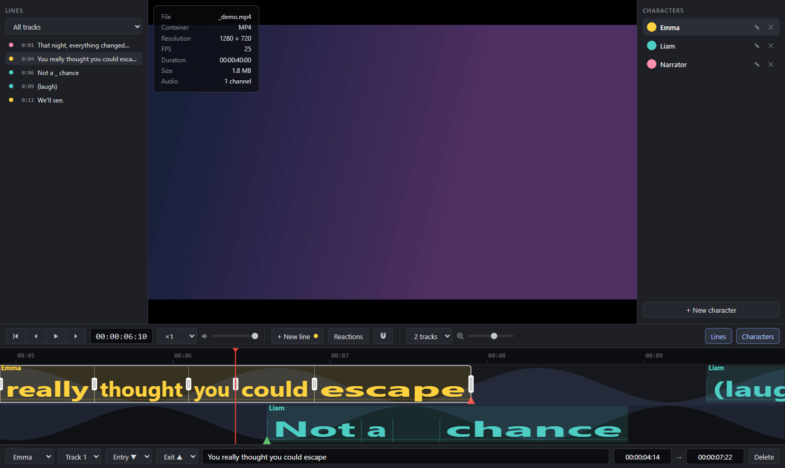
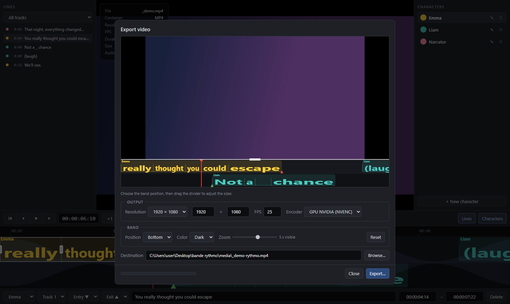
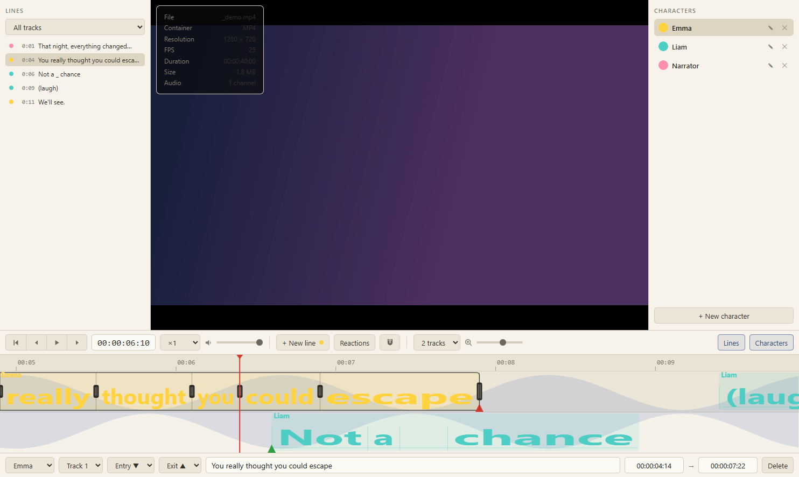

#  LibreRythmo

Free and open source rythmo band editor for dubbing. The dialogue scrolls under the video
and crosses a fixed playhead at the exact frame it must be performed, with per-word elongation.

[](https://github.com/fusorf/LibreRythmo/releases/latest)
[](LICENSE)

**[Download for Windows](https://github.com/fusorf/LibreRythmo/releases/latest)**: portable build, unzip and run `LibreRythmo.exe`.



## Features

- Real-time rythmo band: 1 to 4 tracks, words stretched to their actual duration, frame-accurate sync with the video
- Mouse editing: drag lines, handles on every word boundary to sync each word to the lips, multi-select and group move, proportional stretch (Ctrl+edge), magnet snapping
- Characters: one color per actor, per-line assignment, track filter in the Lines panel
- Entry/exit arrows: mouth open or closed at line start and end, mapped to DETX `in_open/in_close/out_open/out_close`
- DETX import/export (Joker / Cappella ecosystem), `.detx` drag and drop
- SRT import/export, plus re-import of corrected subtitles without touching the timing
- PDF script export: timecoded dubbing script (character, dialogue) for the actors
- Audio scrubbing while dragging the timeline, waveform behind the band, frame rate detection through ffmpeg
- MP4 export: video and band composited (band top or bottom, draggable divider), GPU encoding (NVENC / QuickSync / AMF) with x264 fallback, live preview
- Single-file `.rythmo` projects (plain JSON), autosave, recent projects, undo/redo
- Dark and light themes, English/French UI (follows the OS language)

| MP4 export | Light theme |
|---|---|
|  |  |

## Usage

1. Drop a video into the window (or `Ctrl+O`). Frame rate and waveform are detected automatically.
2. Create your characters in the right panel. The selected one is assigned to new lines.
3. Add lines: import an SRT (`File > Subtitles`), double-click the band, or press `Enter` at the playhead.
4. Sync the text: select a line and drag the word-boundary handles onto the lips. Type `_` as a word for an adjustable silence.
5. Export: `Ctrl+E` for a composited MP4, or PDF script / DETX / SRT from the File menu.

Press `F1` in the app for the full shortcut list.

## Shortcuts

| Shortcut | Action |
|---|---|
| `Space` | Play / pause |
| `Left` / `Right`, `Shift+Left/Right` | Previous / next frame, plus or minus 1 s |
| `Enter` | New line at the playhead |
| double-click (band) | New line there / edit line text |
| `Ctrl+Z` / `Ctrl+Y` | Undo / redo |
| `Ctrl+A`, `Ctrl+click` | Select all, add/remove from selection |
| `Ctrl+drag` (outer edge) | Stretch the whole line proportionally |
| wheel, `Ctrl+wheel` | Scrub, zoom the band |
| `Ctrl+S` / `Ctrl+Shift+S` | Save / Save As |
| `Ctrl+E` | Export video |

## Project format

A `.rythmo` file is plain JSON. Every word carries its own timecodes (seconds), which is what
produces the elongation:

```json
{
  "version": 1,
  "videoPath": "C:\\...\\film.mp4",
  "fps": 25,
  "tracks": 1,
  "characters": [{ "id": "...", "name": "Emma", "color": "#ffd23f" }],
  "lines": [
    {
      "id": "...",
      "characterId": "...",
      "track": 0,
      "entry": "closed",
      "exit": "open",
      "words": [{ "text": "Hello", "start": 1.24, "end": 1.81 }]
    }
  ]
}
```

`tracks` is the number of displayed tracks (1 to 4). `entry` / `exit` (optional, `"open"` or
`"closed"`) are the mouth arrows at line start and end.

DETX note: characters, tracks, texts and entry/exit marks survive the round-trip with
professional tools. DETX stores plain text without per-word timing, so elongation is
redistributed evenly on import.

## Build from source

```bash
npm install
npm start            # run in development
npm run package      # build dist/LibreRythmo-win32-x64/LibreRythmo.exe
```

Releases are built by [GitHub Actions](.github/workflows/release.yml) when a `v*` tag is pushed.

## Code structure

- `main.js`: Electron main process (window, menus, file dialogs, ffmpeg export, PDF)
- `preload.js`: IPC bridge
- `renderer/`: vanilla JS UI, `app.js` (logic + canvas rendering), `i18n.js` (EN/FR)
- `assets/`: icon (SVG source, PNG window, ICO executable)
- `scripts/`: dev tools (drive the app through Chrome DevTools Protocol: launch with `--remote-debugging-port=9222` then `node scripts/cdp-eval.js "expr"`)

## Credits

| Project | Role | License |
|---|---|---|
| [Electron](https://www.electronjs.org/) | Desktop shell (Chromium + Node.js) | MIT |
| [FFmpeg](https://ffmpeg.org/) | Video compositing and encoding | GPL v3 (bundled binary) |
| [ffmpeg-static](https://github.com/eugeneware/ffmpeg-static) | FFmpeg binary distribution | GPL v3 (binary) |
| [@electron/packager](https://github.com/electron/packager) | Executable packaging (dev) | BSD-2-Clause |
| [ws](https://github.com/websockets/ws) | CDP driving in dev scripts | MIT |

The DETX format is documented by the [Joker](https://github.com/MartinDelille/Joker) project.

## License

GPL-3.0-or-later, (c) 2026 fusorf. See [LICENSE](LICENSE).

The FFmpeg binary bundled in the builds keeps its own license (GPL v3, it includes x264):
it is invoked as an external program and its source is available at
[ffmpeg.org](https://ffmpeg.org/).
