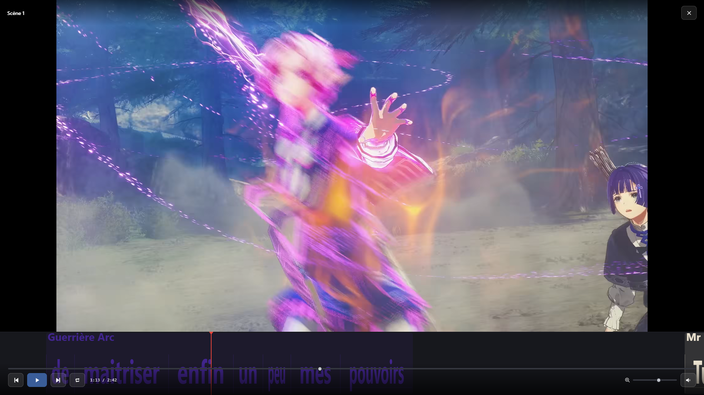
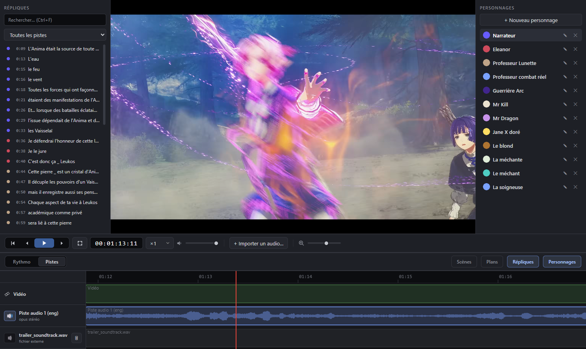

#  LibreRythmo

Free, open-source rythmo band editor for dubbing — sync dialogue to picture frame by frame, then export a composited video or a DETX.

[](https://github.com/fusorf/LibreRythmo/releases/latest)
[](LICENSE)

**[Download](https://github.com/fusorf/LibreRythmo/releases/latest)** — Windows installer (`.exe`) or portable zip, and macOS `.dmg` (Intel & Apple Silicon).


## Features

- **Rythmo band** — 1 to 4 tracks, words stretched to their real duration, frame-accurate sync. Drag lines, snap each word boundary to the lips, multi-select for batch edits (character, font, voice-over), proportional stretch, magnet.
- **Characters & reactions** — one color per actor, French reac lexicon (`ah`, `oh`, `fff`, `(rire)`…) by palette or key, voice-over (underlined). Per-line **custom fonts** (TTF/OTF embedded in the project) plus bundled open-source faces (Inter, Oswald, Comfortaa, Anton).
- **Scenes & shots** — scene markers with live stats (lines, duration, characters), prev/next navigation, OUT segments; a **Shots** panel with automatic shot-change detection (ffmpeg) and down-arrow markers on the timeline.
- **Audio & video tracks** — NLE-style tab: every audio track of the container plus imported files, per-track offset by drag, active track shown as a waveform on the band.
- **Smooth playback** — a 720p H.264 proxy is generated in the background and cached, so 4K/HEVC sources scrub smoothly and play in any codec; the export always re-renders from the full-quality source.
- **Fullscreen playback (F5)** — video + composited band with auto-hiding controls: play, scene jump, loop a scene, band zoom.
- **Import / export** — DETX (Joker / Cappella), SRT / ASS / VTT in (corrected-subtitle re-import for SRT), PDF script and DETX out, MP4 composite with GPU encoding (NVENC / QuickSync / AMF, x264 fallback), an output frame-rate dropdown, and a choice of tracks, scenes and audio track.
- **Projects** — single-file `.rythmo` (JSON), autosave, recent projects, undo/redo, dark/light themes, English/French UI, optional Discord Rich Presence.

| Fullscreen playback (F5) | Audio & video tracks | MP4 export |
|---|---|---|
|  |  |  |

## Usage

1. Drop a video into the window (or `Ctrl+O`).
2. Create your characters in the right panel. The selected one is assigned to new lines.
3. Add lines: import an SRT (`File > Subtitles`), double-click the band, or press `Enter` at the playhead.
4. Select a line and drag the word-boundary handles onto the lips. Type `_` for an adjustable silence.
5. `Ctrl+E` to export a composited MP4, or PDF / DETX / SRT from the File menu.

Press `F1` in the app for the full shortcut list.

## Shortcuts

| Shortcut | Action |
|---|---|
| `Space` | Play / pause |
| `Left` / `Right`, `Shift+Left/Right` | Previous / next frame, ±1 s |
| `Enter` | New line at the playhead |
| `Page Up` / `Page Down` | Previous / next scene |
| `F5` | Fullscreen playback |
| `Ctrl+F` | Search lines |
| `Ctrl+C` / `Ctrl+X` / `Ctrl+V` | Copy / cut / paste lines (timing kept) |
| `Ctrl+Z` / `Ctrl+Y` | Undo / redo |
| wheel, `Ctrl+wheel` | Scrub, zoom the band |
| `Ctrl+S` / `Ctrl+Shift+S` | Save / Save As |
| `Ctrl+E` | Export video |

## Project format

A `.rythmo` file is plain JSON. Every word carries its own timecodes (seconds), which produces the elongation:

```json
{
  "version": 2,
  "videoPath": "C:\\...\\film.mp4",
  "fps": 25,
  "tracks": 1,
  "characters": [{ "id": "...", "name": "Emma", "color": "#c0392b" }],
  "loops": [{ "id": "...", "start": 0, "end": 48, "name": "Scene 1", "type": "normal" }],
  "plans": [{ "id": "...", "time": 12.48, "name": "Shot 1" }],
  "audioTracks": [{ "id": "...", "type": "embedded", "index": 0, "offset": 0 }],
  "defaultFont": null,
  "fonts": [],
  "lines": [
    {
      "id": "...",
      "characterId": "...",
      "track": 0,
      "entry": "closed",
      "exit": "open",
      "voiceOff": false,
      "font": null,
      "words": [{ "text": "Hello", "start": 1.24, "end": 1.81 }]
    }
  ]
}
```

Projects from older versions still open. DETX keeps characters, tracks, texts and entry/exit marks
through the round-trip; it stores plain text without per-word timing, so elongation is redistributed
evenly on import. Scenes, shots and audio tracks stay internal to the `.rythmo` file, and custom
fonts are embedded in it; the low-resolution video proxy is a separate, portable cache
(`./cache/proxies/`) and is never written into the project.

## Build from source

```bash
npm install
npm start            # run in development
npm run package      # portable build → dist/LibreRythmo-win32-x64/ (electron-packager)
npm run dist         # installers → dist-installer/ (electron-builder: NSIS .exe on Windows, .dmg on macOS)
```

Releases are built by [GitHub Actions](.github/workflows/release.yml) when a `v*` tag is pushed:
a Windows installer + portable zip, and macOS `.dmg` for Intel and Apple Silicon.

## Code structure

- `main.js` — Electron main process (window, menus, file dialogs, ffmpeg, PDF, Discord presence)
- `preload.js` — IPC bridge
- `renderer/` — vanilla JS UI: `app.js` (logic + canvas rendering), `i18n.js` (EN/FR), `reacs.js` (reac lexicon)
- `assets/` — icon (SVG source, PNG, ICO)
- `scripts/` — dev tools (drive the app through Chrome DevTools Protocol)

## Credits

| Project | Role | License |
|---|---|---|
| [Electron](https://www.electronjs.org/) | Desktop shell (Chromium + Node.js) | MIT |
| [FFmpeg](https://ffmpeg.org/) | Video compositing and encoding | GPL v3 (bundled binary) |
| [ffmpeg-static](https://github.com/eugeneware/ffmpeg-static) | FFmpeg binary distribution | GPL v3 (binary) |
| [@electron/packager](https://github.com/electron/packager) | Executable packaging (dev) | BSD-2-Clause |
| [ws](https://github.com/websockets/ws) | CDP driving in dev scripts | MIT |

Bundled fonts — [Inter](https://github.com/rsms/inter), [Oswald](https://github.com/googlefonts/OswaldFont),
[Comfortaa](https://github.com/googlefonts/comfortaa) and [Anton](https://github.com/googlefonts/AntonFont) —
are licensed under the [SIL Open Font License 1.1](renderer/fonts/LICENSES.md).

The DETX format is documented by the [Joker](https://github.com/MartinDelille/Joker) project.

## License

GPL-3.0-or-later, (c) 2026 fusorf. See [LICENSE](LICENSE).

The bundled FFmpeg binary keeps its own license (GPL v3, it includes x264): it is invoked as an
external program and its source is available at [ffmpeg.org](https://ffmpeg.org/).
