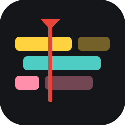
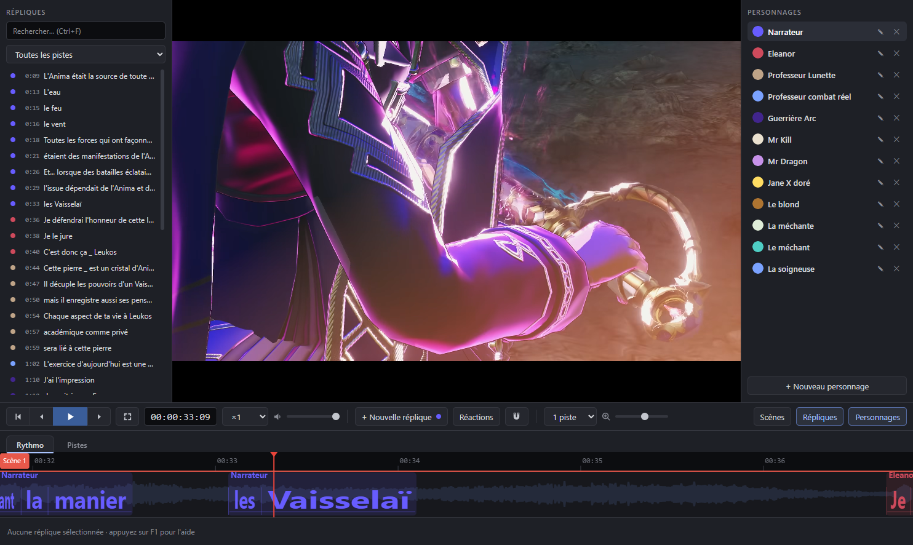
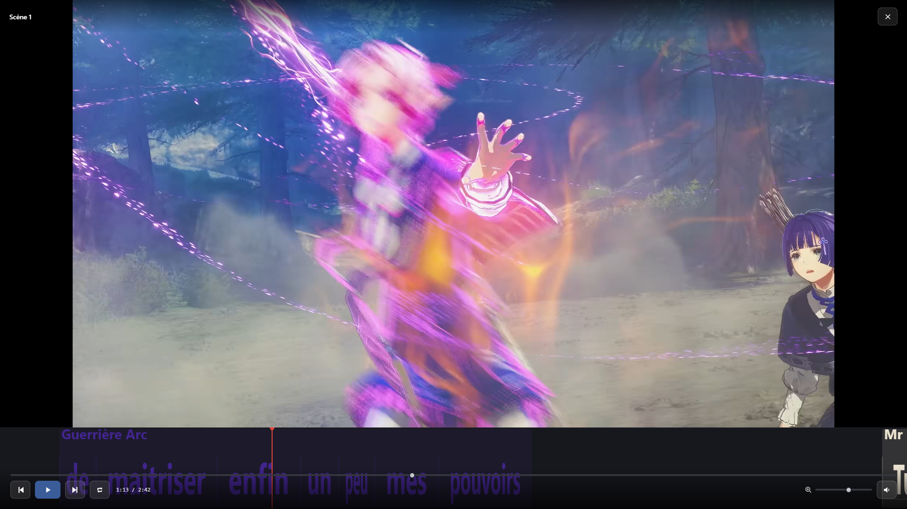
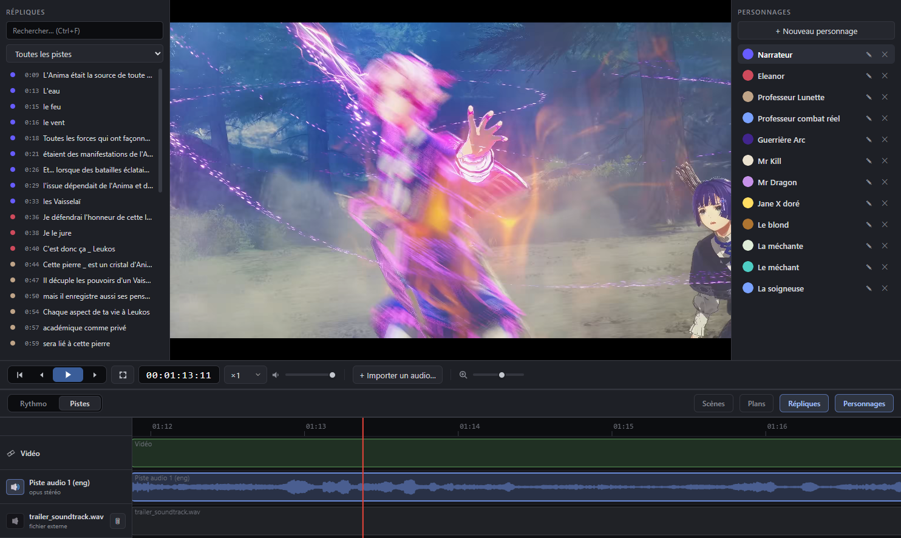
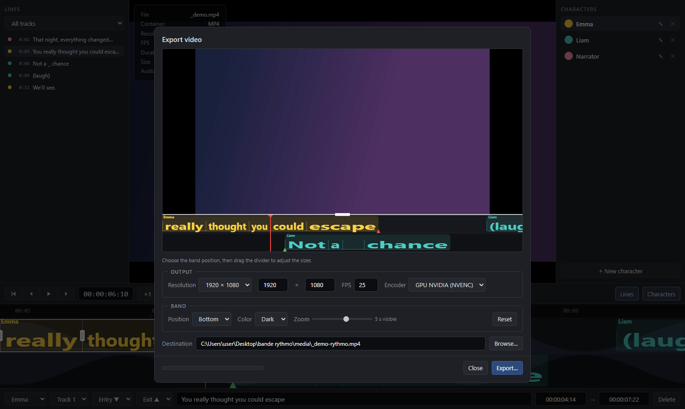

#  LibreRythmo

Free, open-source **dubbing studio**, two complete workflows in one app: **create and export
rythmo band videos** (detection, text, frame-accurate sync, composited MP4 / DETX), and a
**recording mode** to perform the takes - silence any character's original voice and act their
part inside the real soundtrack, every character on their own track, automatic voice chain,
dubbed video out.

[](https://github.com/fusorf/LibreRythmo/releases/latest)
[](LICENSE)

**[Download](https://github.com/fusorf/LibreRythmo/releases/latest)** - Windows installer (`.exe`) or portable zip, macOS `.dmg` (Apple Silicon), and Linux (`AppImage` / `.deb` / `.pacman`).



## Create and export the rythmo band

Everything to go from a raw video to a finished rythmo band video (or a DETX for the pro
ecosystem): write, detect, sync, then export the band composited on the picture.

- **Rythmo band** - 1 to 4 tracks, words stretched to their real duration, frame-accurate sync. Drag lines, snap each word boundary to the lips, multi-select for batch edits (character, font, voice-over), proportional stretch, magnet.
- **Characters & reactions** - one color per actor, quick selection with keys `1`-`9`, French reac lexicon (`ah`, `oh`, `fff`, `(rire)`…) by palette or key, voice-over (underlined). Per-line **custom fonts** (TTF/OTF embedded in the project) plus bundled open-source faces (Inter, Oswald, Comfortaa, Anton).
- **Assisted transcription** - bootstrap the text from the audio: multi-speaker diarization creates one character per detected voice (adjustable voice count), source track and language choice, reactions recognized, text split into lines. Engine and models install on demand from Settings - nothing is bundled.
- **Detection marks** - a palette of articulatory signs (labial, labiodental, rounded, open, dental, velar, nasal, glide) placed on syllables by click or key, drawn on the band everywhere (editor, export, fullscreen) - to learn and practise dubbing detection.
- **ADR cues** - streamers (sweeping wipe) and punches (flash) over the picture, editable on the timeline, to cue the actor without lip-sync (voice-over, audio description, game localization).
- **Scenes & shots** - scene markers with live stats (lines, duration, characters), prev/next navigation, OUT segments; a **Shots** panel with automatic shot-change detection (ffmpeg) and down-arrow markers on the timeline.
- **Work documents (PDF)** - a presence grid (characters × scenes) and a per-character line tally to organize a recording session.
- **Video export** - composite MP4 with GPU encoding (NVENC / QuickSync / AMF, x264 fallback), output frame-rate dropdown, and a choice of rythmo tracks, scenes and audio track. Band at the top or bottom, dark or light.
- **Interchange** - DETX (Joker / Cappella) round-trip, SRT / ASS / VTT import (with corrected-subtitle re-import for SRT), DETX and PDF out.

## Record the takes

A recording mode built around the band you just made: silence the character you're playing,
perform over the real scene, keep the best takes, and deliver the dubbed video.

- **Mute one character's voice** - the scene keeps playing with its original mix, but during that
  character's lines the audio swaps to the instrumental: their voice drops out, everyone else stays.
  Act your part inside the real soundtrack instead of over it (pairs with the voice remover below,
  which produces the instrumental).

- **Recording studio** - a dedicated tab showing the band in final-render mode: pick a character (keys `1`-`9`), press record and act. Each character has their own track; overlapping recordings stack up as takes - keep the best one, trim, drag, compare waveforms. Automatic latency compensation (measured pre-roll + reported pipeline latency + hardware margin, fine-tunable in Settings).
- **Automatic voice chain (FX)** - every take is analyzed and processed offline: corrective EQ, dynamic de-esser and plosive tamer, compression, loudness matched to the video track. Pre-rendered as sidecar files; toggle it for playback, choose raw or FX at export.
- **Voice removal** - produce an instrumental from any audio track with a light local engine (MDX-Net ONNX). Optional, installed on demand - nothing bundled.
- **Input & output devices** - WASAPI or DirectShow capture, input/output selection with a live monitor test, all in Settings; devices are remembered by name.
- **Dubbed video export** - the video export mixes the recordings of the characters you pick into the output (raw or FX); set the band to « none » to deliver the dubbed video alone.
- **Recordings export (ZIP)** - one mixed track per character laid out on the project timeline (plus optionally every detached take), raw or FX.

## Everyday

- **Playback** - fullscreen render preview (`F5`) with auto-hiding controls, and a detached **Monitoring** window to put the rendered picture on a second screen.

- **Audio & video tracks** - NLE-style tab: every audio track of the container plus imported files, per-track offset by drag, active track shown as a waveform on the band, full-width timeline with a line map.
- **Smooth playback** - a 720p H.264 proxy is generated in the background and cached, so 4K/HEVC sources scrub smoothly and play in any codec; the export always re-renders from the full-quality source.
- **YouTube import** - download a video straight into the project (bundled yt-dlp): quality pick and trim.
- **Settings** - capture devices and the model manager (transcription + voice removal): installing/removing engines and models is entirely optional, done from the interface, with download-size estimates.
- **Quality of life** - character merge, video zoom by rectangle, free bookmarks distinct from scenes/shots, resume at the saved playhead, project name suggested from the video file.
- **Projects** - single-file `.rythmo` (JSON), autosave, recent projects, undo/redo, dark/light themes, **English / French / Spanish** UI (system language by default), optional Discord Rich Presence.

| Fullscreen playback (F5) | Audio & video tracks | MP4 export |
|---|---|---|
|  |  |  |

## Usage

1. Drop a video into the window (`Ctrl+O`, or `File > Import from YouTube`).
2. Create your characters in the right panel. The selected one is assigned to new lines.
3. Add lines: import an SRT (`File > Subtitles`), run the assisted transcription (`Tools`), double-click the band, or press `Enter` at the playhead.
4. Select a line and drag the word-boundary handles onto the lips. Type `_` for an adjustable silence.
5. Open the **Recording** tab, pick a character (`1`-`9`) and mute them - their original voice drops out during their lines. Record over the scrolling band: takes stack up, keep the best ones, enable **FX** to polish the sound.
6. `Ctrl+E` to export the composited MP4 with the voices mixed in, `File > Export recordings` for a ZIP of the voice tracks, or PDF / DETX / SRT from the File menu.

Press `F1` in the app for the full shortcut list.

## Shortcuts

| Shortcut | Action |
|---|---|
| `Space` | Play / pause |
| `Left` / `Right`, `Shift+Left/Right` | Previous / next frame, ±1 s |
| `Enter` | New line at the playhead |
| `1`-`9` | Select character |
| `Page Up` / `Page Down` | Previous / next scene |
| `F5` | Fullscreen playback |
| `Ctrl+F` | Search lines |
| `Ctrl+B`, `Ctrl+,` / `Ctrl+.` | Add/remove bookmark, previous / next bookmark |
| `Ctrl+C` / `Ctrl+X` / `Ctrl+V` | Copy / cut / paste lines (timing kept) |
| `Ctrl+Z` / `Ctrl+Y` | Undo / redo |
| wheel, `Ctrl+wheel` | Scrub, zoom the band |
| `Ctrl+S` / `Ctrl+Shift+S` | Save / Save As |
| `Ctrl+E` | Export video |

## Project format

A `.rythmo` file is plain JSON. Every word carries its own timecodes (seconds), which produces the elongation:

```json
{
  "version": 2,
  "videoPath": "C:\\...\\film.mp4",
  "fps": 25,
  "tracks": 1,
  "characters": [{ "id": "...", "name": "Emma", "color": "#c0392b" }],
  "loops": [{ "id": "...", "start": 0, "end": 48, "name": "Scene 1", "type": "normal" }],
  "plans": [{ "id": "...", "time": 12.48, "name": "Shot 1" }],
  "audioTracks": [{ "id": "...", "type": "embedded", "index": 0, "offset": 0 }],
  "recordings": [{ "id": "...", "characterId": "...", "file": "rec_….webm", "startTime": 3.2, "dur": 2.4, "active": true }],
  "defaultFont": null,
  "fonts": [],
  "lines": [
    {
      "id": "...",
      "characterId": "...",
      "track": 0,
      "entry": "closed",
      "exit": "open",
      "voiceOff": false,
      "font": null,
      "words": [{ "text": "Hello", "start": 1.24, "end": 1.81 }]
    }
  ]
}
```

Projects from older versions still open. DETX keeps characters, tracks, texts and entry/exit marks
through the round-trip; it stores plain text without per-word timing, so elongation is redistributed
evenly on import. Scenes, shots, audio tracks, detection marks, ADR cues and bookmarks stay internal
to the `.rythmo` file, and custom fonts are embedded in it. Voice takes are portable sidecar files
(`takes/` next to the project, FX-processed versions alongside); the low-resolution video proxy is a
separate, portable cache (`./cache/proxies/`) and is never written into the project.

## Build from source

```bash
npm install
npm start            # run in development
npm run package      # portable build → dist/LibreRythmo-win32-x64/ (electron-packager)
npm run dist         # installers → dist-installer/ (electron-builder: NSIS .exe on Windows, .dmg on macOS)
```

Releases are built by [GitHub Actions](.github/workflows/release.yml) when a `v*` tag is pushed:
a Windows installer + portable zip, macOS `.dmg` (Apple Silicon), and Linux
`AppImage` / `.deb` (Ubuntu/Debian) / `.pacman` (Arch).

## Code structure

- `main.js` - Electron main process (window, menus, file dialogs, ffmpeg, PDF, Discord presence)
- `preload.js` - IPC bridge
- `renderer/` - vanilla JS UI: `app.js` (logic + canvas rendering), `i18n.js` (EN/FR/ES), `reacs.js` (reac lexicon), `detection.js` (detection-mark lexicon)
- `assets/` - icon (SVG source, PNG, ICO)
- `scripts/` - dev tools (drive the app through Chrome DevTools Protocol): `smoke.js` (boot check), `ftest.js` (functional checks)

## Credits

| Project | Role | License |
|---|---|---|
| [Electron](https://www.electronjs.org/) | Desktop shell (Chromium + Node.js) | MIT |
| [FFmpeg](https://ffmpeg.org/) | Video compositing and encoding | GPL v3 (bundled binary) |
| [ffmpeg-static](https://github.com/eugeneware/ffmpeg-static) | FFmpeg binary distribution | GPL v3 (binary) |
| [yt-dlp](https://github.com/yt-dlp/yt-dlp) | YouTube video import | Unlicense (bundled binary) |
| [@electron/packager](https://github.com/electron/packager) | Executable packaging (dev) | BSD-2-Clause |
| [ws](https://github.com/websockets/ws) | CDP driving in dev scripts | MIT |

Bundled fonts - [Inter](https://github.com/rsms/inter), [Oswald](https://github.com/googlefonts/OswaldFont),
[Comfortaa](https://github.com/googlefonts/comfortaa) and [Anton](https://github.com/googlefonts/AntonFont) -
are licensed under the [SIL Open Font License 1.1](renderer/fonts/LICENSES.md).

The DETX format is documented by the [Joker](https://github.com/MartinDelille/Joker) project.

## License

GPL-3.0-or-later, (c) 2026 fusorf. See [LICENSE](LICENSE).

The bundled FFmpeg binary keeps its own license (GPL v3, it includes x264): it is invoked as an
external program and its source is available at [ffmpeg.org](https://ffmpeg.org/).

The bundled yt-dlp binary is released under the [Unlicense](https://github.com/yt-dlp/yt-dlp/blob/master/LICENSE)
(public domain); it is likewise invoked as an external program.
